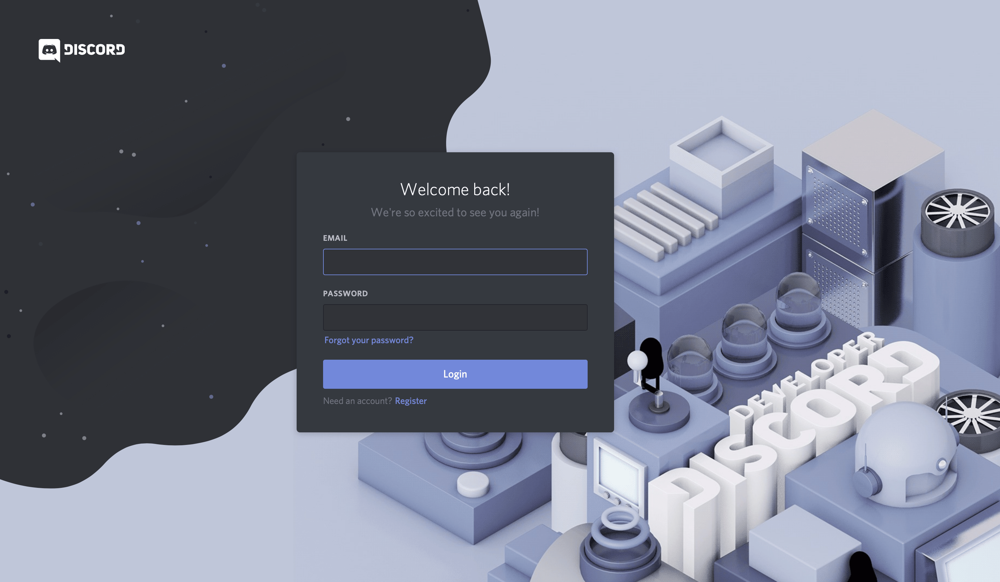

#How to Make a Discord Bot in the Developer Portal?
Before you can dive into any Python code to handle events and create exciting automations, you need to first create a few Discord components:

1. An account
2. An application
3. A bot
4. A guild
You’ll learn more about each piece in the following sections.

Once you’ve created all of these components, you’ll tie them together by registering your bot with your guild.

You can get started by heading to Discord’s Developer Portal.

Creating a Discord Account
The first thing you’ll see is a landing page where you’ll need to either login, if you have an existing account, or create a new account:

