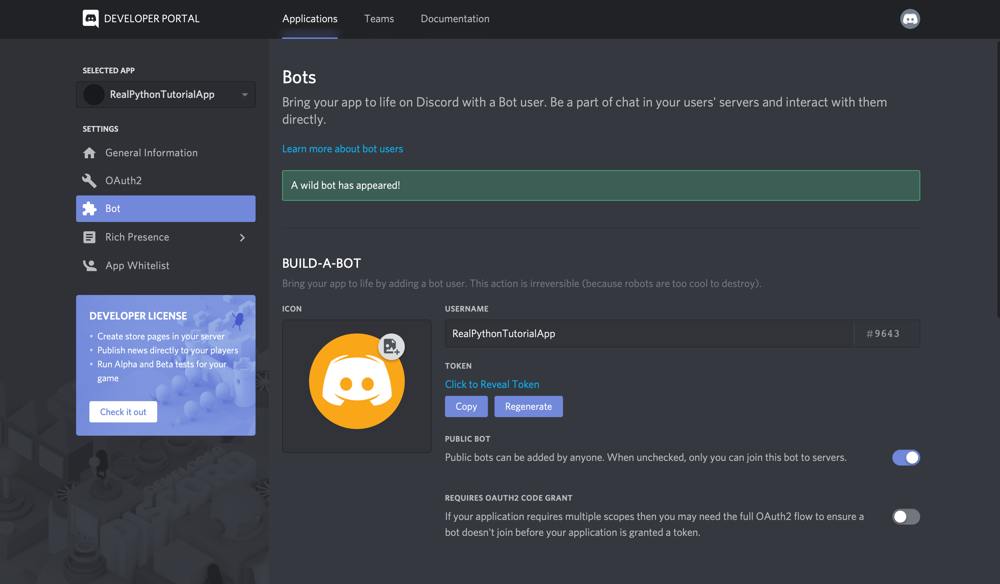

# How to Make a Discord Bot in the Developer Portal?

Before you can dive into any Python code to handle events and create exciting automations, you need to first create a few Discord components:

1. An account
2. An application
3. A bot
4. A guild
You’ll learn more about each piece in the following sections.

Once you’ve created all of these components, you’ll tie them together by registering your bot with your guild.

You can get started by heading to Discord’s Developer Portal.

<h2>Creating a Discord Account</h2>

The first thing you’ll see is a landing page where you’ll need to either login, if you have an existing account, or create a new account:

If you need to create a new account, then click on the Register button below Login and enter your account information.
Once you’re finished, you’ll be redirected to the Developer Portal home page, where you’ll create your application.

<h2>Creating Application</h2>
An application allows you to interact with Discord’s APIs by providing authentication tokens, designating permissions, and so on.

To create a new application, select New Application:

Next, you’ll be prompted to name your application. Select a name and click Create:

Congratulations! You made a Discord application. On the resulting screen, you can see information about your application:

Keep in mind that any program that interacts with Discord APIs requires a Discord application, not just bots. Bot-related APIs are only a subset of Discord’s total interface.

However, since this tutorial is about how to make a Discord bot, navigate to the Bot tab on the left-hand navigation list.

<h2>Creating a Bot</h2>

As you learned in the previous sections, a bot user is one that listens to and automatically reacts to certain events and commands on Discord.

For your code to actually be manifested on Discord, you’ll need to create a bot user. To do so, select Add Bot:

Once you confirm that you want to add the bot to your application, you’ll see the new bot user in the portal:

Notice that, by default, your bot user will inherit the name of your application. Instead, update the username to something more bot-like, such as RealPythonTutorialBot, and Save Changes:

Now, the bot’s all set and ready to go, but to where?

A bot user is not useful if it’s not interacting with other users. Next, you’ll create a guild so that your bot can interact with other users.

<h2>Creating a Guild</h2>

A <b>guild</b> (or a <b>server</b>, as it is often called in Discord’s user interface) is a specific group of channels where users congregate to chat.

How to Make a Discord Bot in Python
by Alex Ronquillo  Aug 19, 2019 72 Comments
 api intermediate projects
Share Share Email
Table of Contents

What Is Discord?
What Is a Bot?
How to Make a Discord Bot in the Developer Portal
Creating a Discord Account
Creating an Application
Creating a Bot
Creating a Guild
Adding a Bot to a Guild
How to Make a Discord Bot in Python
Creating a Discord Connection
Interacting With Discord APIs
Using Utility Functions
Responding to Events
Welcoming New Members
Responding to Messages
Handling Exceptions
Connecting a Bot
Using Bot Commands
Converting Parameters Automatically
Checking Command Predicates
Conclusion
Remove ads
 Watch Now This tutorial has a related video course created by the Real Python team. Watch it together with the written tutorial to deepen your understanding: Creating a Discord Bot in Python

In a world where video games are so important to so many people, communication and community around games are vital. Discord offers both of those and more in one well-designed package. In this tutorial, you’ll learn how to make a Discord bot in Python so that you can make the most of this fantastic platform.

By the end of this article you’ll learn:

What Discord is and why it’s so valuable
How to make a Discord bot through the Developer Portal
How to create Discord connections
How to handle events
How to accept commands and validate assumptions
How to interact with various Discord APIs
You’ll begin by learning what Discord is and why it’s valuable.

What Is Discord?
Discord is a voice and text communication platform for gamers.

Players, streamers, and developers use Discord to discuss games, answer questions, chat while they play, and much more. It even has a game store, complete with critical reviews and a subscription service. It is nearly a one-stop shop for gaming communities.

While there are many things you can build using Discord’s APIs, this tutorial will focus on a particular learning outcome: how to make a Discord bot in Python.

Remove ads
What Is a Bot?
Discord is growing in popularity. As such, automated processes, such as banning inappropriate users and reacting to user requests are vital for a community to thrive and grow.

Automated programs that look and act like users and automatically respond to events and commands on Discord are called bot users. Discord bot users (or just bots) have nearly unlimited applications.

For example, let’s say you’re managing a new Discord guild and a user joins for the very first time. Excited, you may personally reach out to that user and welcome them to your community. You might also tell them about your channels or ask them to introduce themselves.

The user feels welcomed and enjoys the discussions that happen in your guild and they, in turn, invite friends.

Over time, your community grows so big that it’s no longer feasible to personally reach out to each new member, but you still want to send them something to recognize them as a new member of the guild.

With a bot, it’s possible to automatically react to the new member joining your guild. You can even customize its behavior based on context and control how it interacts with each new user.

This is great, but it’s only one small example of how a bot can be useful. There are so many opportunities for you to be creative with bots, once you know how to make them.

Note: Although Discord allows you to create bots that deal with voice communication, this article will stick to the text side of the service.

There are two key steps when you’re creating a bot:

Create the bot user on Discord and register it with a guild.
Write code that uses Discord’s APIs and implements your bot’s behaviors.
In the next section, you’ll learn how to make a Discord bot in Discord’s Developer Portal.

How to Make a Discord Bot in the Developer Portal
Before you can dive into any Python code to handle events and create exciting automations, you need to first create a few Discord components:

An account
An application
A bot
A guild
You’ll learn more about each piece in the following sections.

Once you’ve created all of these components, you’ll tie them together by registering your bot with your guild.

You can get started by heading to Discord’s Developer Portal.

Creating a Discord Account
The first thing you’ll see is a landing page where you’ll need to either login, if you have an existing account, or create a new account:

Discord: Account Login Screen
If you need to create a new account, then click on the Register button below Login and enter your account information.

Important: You’ll need to verify your email before you’re able to move on.

Once you’re finished, you’ll be redirected to the Developer Portal home page, where you’ll create your application.

Remove ads
Creating an Application
An application allows you to interact with Discord’s APIs by providing authentication tokens, designating permissions, and so on.

To create a new application, select New Application:

Discord: My Applications Screen
Next, you’ll be prompted to name your application. Select a name and click Create:

Discord: Naming an Application
Congratulations! You made a Discord application. On the resulting screen, you can see information about your application:

Discord: Application General Information
Keep in mind that any program that interacts with Discord APIs requires a Discord application, not just bots. Bot-related APIs are only a subset of Discord’s total interface.

However, since this tutorial is about how to make a Discord bot, navigate to the Bot tab on the left-hand navigation list.

Creating a Bot
As you learned in the previous sections, a bot user is one that listens to and automatically reacts to certain events and commands on Discord.

For your code to actually be manifested on Discord, you’ll need to create a bot user. To do so, select Add Bot:

Discord: Add Bot
Once you confirm that you want to add the bot to your application, you’ll see the new bot user in the portal:

Discord: Bot Created Successfully
Notice that, by default, your bot user will inherit the name of your application. Instead, update the username to something more bot-like, such as RealPythonTutorialBot, and Save Changes:

Discord: Rename Bot
Now, the bot’s all set and ready to go, but to where?

A bot user is not useful if it’s not interacting with other users. Next, you’ll create a guild so that your bot can interact with other users.

Remove ads
Creating a Guild
A guild (or a server, as it is often called in Discord’s user interface) is a specific group of channels where users congregate to chat.

For example, say you want to create a space where users can come together and talk about your latest game. You’d start by creating a guild. Then, in your guild, you could have multiple channels, such as:

- General Discussion: A channel for users to talk about whatever they want
- Spoilers, Beware: A channel for users who have finished your game to talk about all the end game reveals
- Announcements: A channel for you to announce game updates and for users to discuss them

Once you’ve created your guild, you’d invite other users to populate it.

So, to create a guild, head to your Discord home page:

From this home page, you can view and add friends, direct messages, and guilds. From here, select the + icon on the left-hand side of the web page to Add a Server:

This will present two options, Create a server and Join a Server. In this case, select Create a server and enter a name for your guild.
Once you’ve finished creating your guild, you’ll be able to see the users on the right-hand side and the channels on the left:

The final step on Discord is to register your bot with your new guild.

<h3>Adding a Bot to a Guild</h3>

A bot can’t accept invites like a normal user can. Instead, you’ll add your bot using the OAuth2 protocol.

To do so, head back to the Developer Portal and select the OAuth2 page from the left-hand navigation:

From this window, you’ll see the OAuth2 URL Generator.

This tool generates an authorization URL that hits Discord’s OAuth2 API and authorizes API access using your application’s credentials.

In this case, you’ll want to grant your application’s bot user access to Discord APIs using your application’s OAuth2 credentials.

To do this, scroll down and select bot from the SCOPES options and Administrator from BOT PERMISSIONS:

Now, Discord has generated your application’s authorization URL with the selected scope and permissions.

Select Copy beside the URL that was generated for you, paste it into your browser, and select your guild from the dropdown options:

If you go back to your guild, then you’ll see that the bot has been added:

In summary, you’ve created:

- An <b>application</b> that your bot will use to authenticate with Discord’s APIs
- A <b>bot</b> user that you’ll use to interact with other users and events in your guild
- A <b>guild</b> in which your user account and your bot user will be active
- A <b>Discord</b> account with which you created everything else and that you’ll use to interact with your bot
Now, you know how to make a Discord bot using the Developer Portal. Next comes the fun stuff: implementing your bot in Python!

# Running Bot

First, you should import Discord.py.
$ pip install -U discord.py

And then, run bot.py
python bot.py

Now, you can enjoy your bot :)
